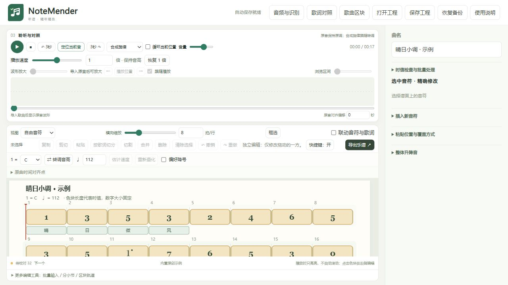

# NoteMender（听谱）

本机运行的单声部简谱制作与校对工具。自动识别提供初稿，操作者可以边听原曲边修改音符和歌词。

## 主要功能

- 横向自由缩放的简谱；拖动音符位置、左右边界，或输入精确数值。
- Ctrl 自由多选、跨行框选、复制粘贴、切割、合并、批量升降音和撤销重做。
- 原音波形、播放光标、循环试听与 0.50–1.50 倍保音高慢放。
- 按段生成主旋律候选；切换人声、吉他、钢琴、贝斯等分轨及识别方案。
- 歌词转写、原音时间对齐、同屏编辑；支持按歌词切分长音。音符与歌词联动由操作者主动开启。
- JSON 工程保存与恢复，MIDI 导入，SVG、MIDI、合成 WAV 和打印导出。

自动识别仍可能漏音、错音或把时长识别错。候选经确认后才进入工作区，保留备选供比较；本项目欢迎通过 [Issues](https://github.com/goldotto/NoteMender/issues) 反馈问题或提交修复。

## 界面



## 运行

桌面启动器和可选组件安装脚本以 Windows x64 为目标。安装 [Node.js 22 或更新版本](https://nodejs.org/)，在本目录运行：

```text
npm ci
npm run build
npm start
```

打开终端显示的 `http://127.0.0.1:端口/`。服务只监听本机。

本目录包含网页依赖的构建结果和浏览器 Basic Pitch 模型。已有 Node.js 时，也可直接双击 `启动听谱.cmd`。源码下载不包含 Node.js、Python 环境或可选模型；编辑、MIDI 和浏览器识别可以先使用，分轨及歌词功能需要下面的组件。

### 可选本机组件

| 功能 | 安装入口 |
| --- | --- |
| 基础音频解码与 Demucs 分轨 | `下载运行环境.cmd` |
| CPU 原生加速 | `scripts/安装加速组件.ps1` |
| NVIDIA 显卡加速 | `scripts/安装加速组件.ps1 -GPU` |
| 六轨器乐候选 | `scripts/安装候选组件.ps1` |
| ROSVOT 演唱候选 | `scripts/安装候选组件.ps1 -Singing` |
| Qwen 歌词转写与对齐 | `scripts/安装歌词组件.ps1` |

组件写入本项目 `runtime/` 或项目虚拟环境；安装脚本会检查可复用的本机环境。首次下载需要联网，模型就绪后在本机运行。显卡后端还需要通过一致性检查；详细步骤见 [组件说明](docs/组件说明.md)。当前模式始终可作为默认使用方式。

## 使用

1. 导入歌曲，点“生成简谱”。可只生成指定区块。
2. 在候选窗口选择要保留的音轨及方案，点“放入工作区修改”。收起候选后可再次打开。
3. 慢放或循环原音，点击音符修改；需要多音操作时 Ctrl 点击或框选。
4. 如需歌词，打开“歌词对照”，先校正文字与原音时间，再关联音符。
5. 经常使用“保存工程”另存 JSON。更换设备时复制 `runtime/audio-resources/`，或重新关联原音。

程序顶部“使用说明”提供可搜索的内置说明书；也可阅读 [说明书.txt](说明书.txt) 和 [识别方案说明](docs/识别方案说明.md)。工程 JSON 的导入和保存上限均为 32 MB。

## 反馈与参与

请说明操作步骤、预期结果、实际结果及运行环境。识别问题请标明出错时间、使用的音轨和识别方案；只上传你愿意公开且有权分享的最小复现素材。

```text
npm ci
npm run build
npm test
```

程序入口为 `server.mjs`，编辑器为 `public/app.mjs`，浏览器识别入口为 `src/worker.mjs`。构建脚本和自动测试随代码提供。

## 许可证与第三方项目

项目自有代码采用 [MIT 许可证](LICENSE)，允许使用、修改、分发及商用，须保留版权和许可声明。第三方代码、模型及组件仍遵守各自许可证。

使用的主要项目包括 [Basic Pitch](https://github.com/spotify/basic-pitch)、[Pitchy](https://github.com/ianprime0509/pitchy)、[Demucs](https://github.com/facebookresearch/demucs)、[librosa / pYIN](https://github.com/librosa/librosa)、[torchcrepe](https://github.com/maxrmorrison/torchcrepe)、[ROSVOT](https://github.com/RickyL-2000/ROSVOT)、[Qwen3-ASR](https://github.com/QwenLM/Qwen3-ASR)、[SoundTouchJS](https://github.com/cutterbl/SoundTouchJS)、[ONNX Runtime](https://github.com/microsoft/onnxruntime)、[TensorFlow.js](https://github.com/tensorflow/tfjs) 和 [Tonejs/Midi](https://github.com/Tonejs/Midi)。各组件与模型保留原有许可，详见 [第三方说明](licenses/THIRD_PARTY_NOTICES.md)。
